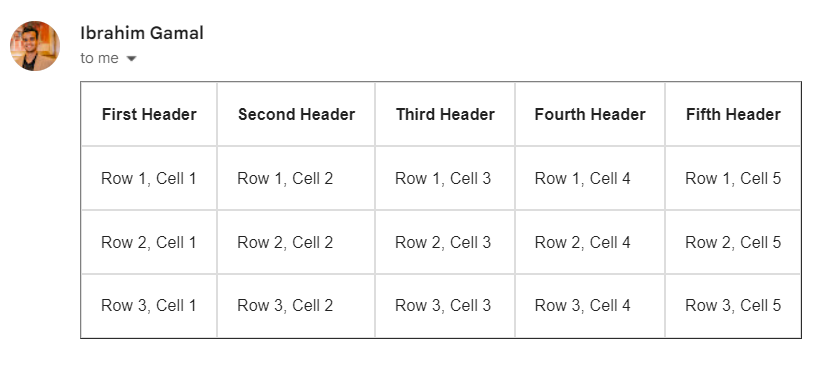

# How to Insert Code into Gmail from index.html

Follow the steps below to insert a table from `index.html` file into a Gmail:

1. **Copy the code from `index.html` file**: .

        

2. **Open mail in your prefered browser and write ####### as mail body**:

    

3. **Right Click on the ####### and click Inspect**: 

4. **Click Edit over the element and Ctra+A Then Ctrl+V (The index.html content)**: 

    

5. **Click anyway else in the screen and voala**: Here are the results, edit the styling as needed

    

    

## Result

After following these steps, you should have successfully inserted a table from your `index.html` file into a Gmail message.